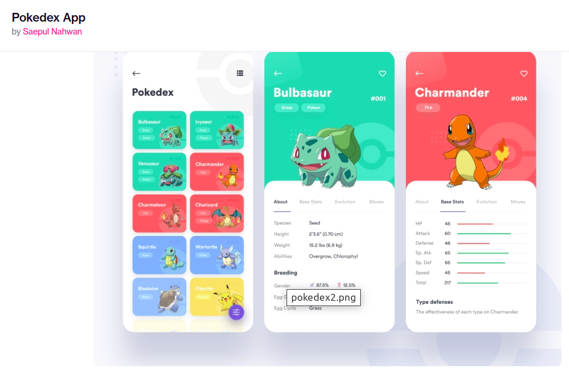

# Pokedex 🐉⚡👾

The objective of this project is to create a Pokedex using HTML, CSS, JAVASCRIPT and data from the PokeApi server.



[Click here to view the web page via github pages] (https://felipecostamartins.github.io/js-developer-pokedex/)

> Project for [DIO](https://web.dio.me/) Bootcamp " Frontend development with Angular "

```javascript
⢀⡀⠀⠀⠀⠀⠀⠀⠀⠀⠀⠀⠀⠀⠀⠀⠀⠀⠀⠀⠀⠀⠀⠀⠀⠀⠀⠀⠀⠀
⢻⣿⡗⢶⣤⣀⠀⠀⠀⠀⠀⠀⠀⠀⠀⠀⠀⠀⠀⠀⠀⠀⠀⠀⠀⠀⠀⣀⣠⣄
⠀⢻⣇⠀⠈⠙⠳⣦⣀⠀⠀⠀⠀⠀⠀⠀⠀⠀⠀⠀⠀⠀⣀⣤⠶⠛⠋⣹⣿⡿
⠀⠀⠹⣆⠀⠀⠀⠀⠙⢷⣄⣀⣀⣀⣤⣤⣤⣄⣀⣴⠞⠋⠉⠀⠀⠀⢀⣿⡟⠁
⠀⠀⠀⠙⢷⡀⠀⠀⠀⠀⠉⠉⠉⠀⠀⠀⠀⠀⠀⠀⠀⠀⠀⠀⠀⣠⡾⠋⠀⠀
⠀⠀⠀⠀⠈⠻⡶⠂⠀⠀⠀⠀⠀⠀⠀⠀⠀⠀⠀⠀⠀⠀⢠⣠⡾⠋⠀⠀⠀⠀
⠀⠀⠀⠀⠀⣼⠃⠀⢠⠒⣆⠀⠀⠀⠀⠀⠀⢠⢲⣄⠀⠀⠀⢻⣆⠀⠀⠀⠀⠀
⠀⠀⠀⠀⢰⡏⠀⠀⠈⠛⠋⠀⢀⣀⡀⠀⠀⠘⠛⠃⠀⠀⠀⠈⣿⡀⠀⠀⠀⠀
⠀⠀⠀⠀⣾⡟⠛⢳⠀⠀⠀⠀⠀⣉⣀⠀⠀⠀⠀⣰⢛⠙⣶⠀⢹⣇⠀⠀⠀⠀
⠀⠀⠀⠀⢿⡗⠛⠋⠀⠀⠀⠀⣾⠋⠀⢱⠀⠀⠀⠘⠲⠗⠋⠀⠈⣿⠀⠀⠀⠀
⠀⠀⠀⠀⠘⢷⡀⠀⠀⠀⠀⠀⠈⠓⠒⠋⠀⠀⠀⠀⠀⠀⠀⠀⠀⢻⡇⠀⠀⠀
⠀⠀⠀⠀⠀⠈⡇⠀⠀⠀⠀⠀⠀⠀⠀⠀⠀⠀⠀⠀⠀⠀⠀⠀⠀⢸⣧⠀⠀⠀
⠀⠀⠀⠀⠀⠈⠉⠉⠉⠉⠉⠉⠉⠉⠉⠉⠉⠉⠉⠉⠉⠉⠉⠉⠉⠉⠁⠀⠀⠀⠀⠀⠀⠀⠀⠀⠀⠀⠀⠀⠀⠀⠀⠀⠀
```
[project base] (https://axlbr.github.io/js-developer-pokedex/)